# *Aedes albopictus* Reference Genome Pipeline

Welcome! This *README* file will describe the genome I selected and how the Makefile in this directory should be used.

### First, here are some details about the genome we shall visualize:

* This is the genome assembly of an adult male Asian Tigo mosquito known as *Aedes albopictus* (AalbF5) which is an invasive species and a competent arbovirus vector. 
* The genome has a size of 1.3 Gb.  
    * It has 3 chromosomes.
* The annotation file contains 25,320 gene annotations.
* I don't think this genomic build is sufficiently complete because it notes that it "includes 1,493 unplaced scaffolds"
    * However, this is an understandable problem given the large genome size.


The automated `Makefile` fetches the **AalbF5** assembly (NCBI Accession: `GCF_035046485.1`), decompresses the nucleotide sequences, sorts the GFF annotations, and generates the `.fai` and `.tbi` indices required for visualization and read mapping.

## Prerequisites

To execute this pipeline, you need `samtools` installed on your system. If you use Conda/Miniconda, you can install the dependencies via Bioconda.


## Running the makefile

To run the full pipeline, navigate to the directory containing the Makefile and execute:
```bash
make
```

Once the make command finishes successfully, you can explore the genome and gene models using the Integrative Genomics Viewer (`IGV`) desktop application.


## Visualize the genome

After visualing the genome in IGV:

* How tightly packed are the genes in this genome? Estimate the gene-to-gene distance via the browser.
    * Based on the characterized genes, the genome seems quite tightly packed with gene-to-gene distances ranging from 6-89 kb. See below:

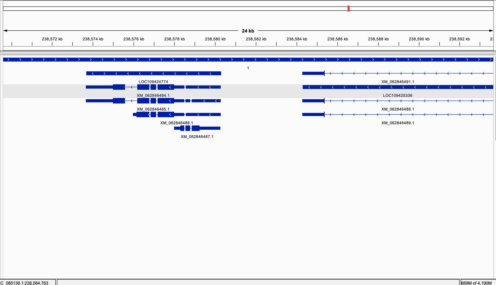
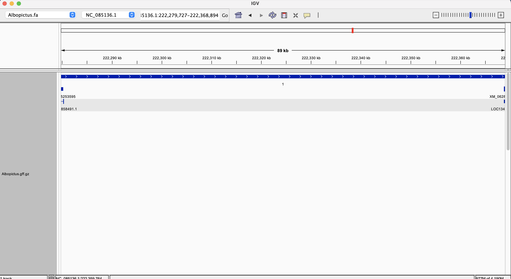
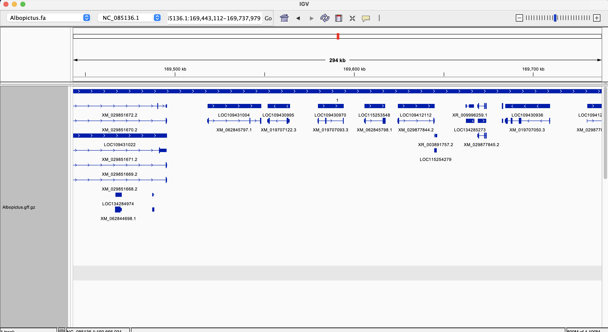
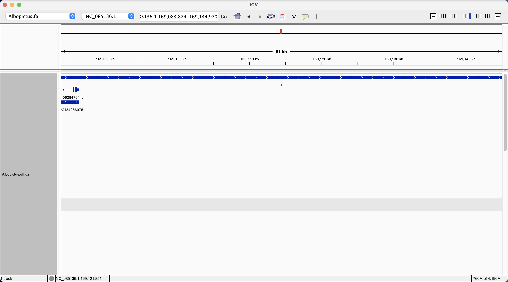
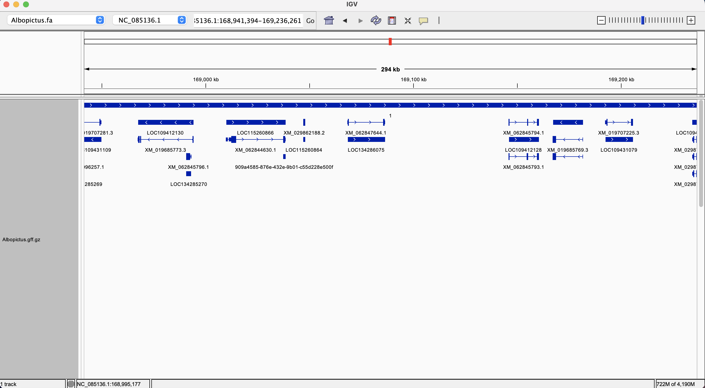


* Now, visually inspect the sequence regions around a coordinate on the chromosome and all six reading frames (codons) that the coordinate could be part of.

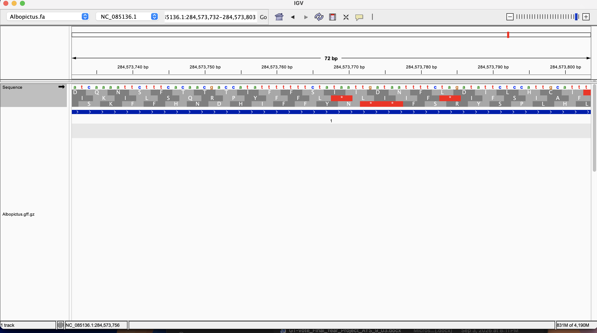
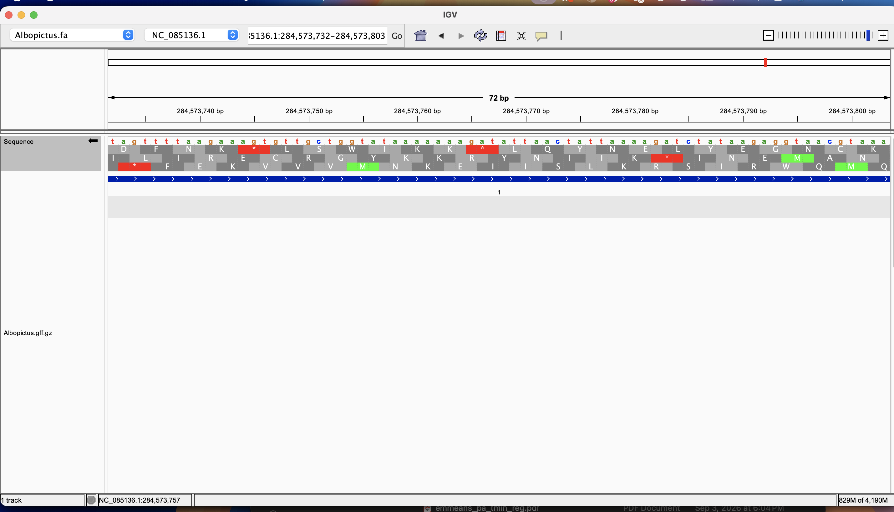
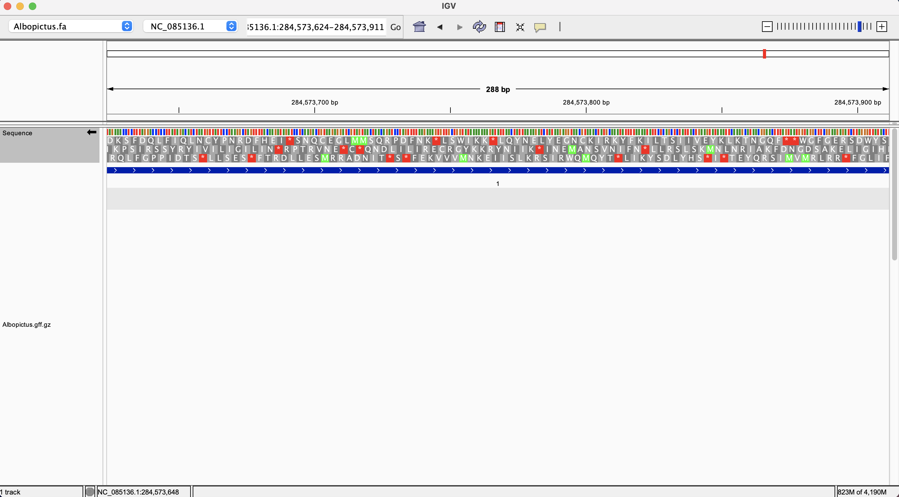
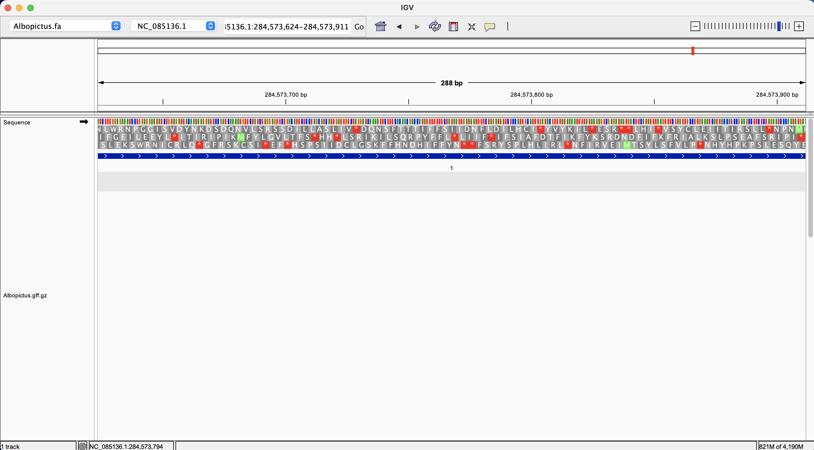

* The type of feature displayed below is a gene, specifically the protein coding hydroxylysine kinase gene.

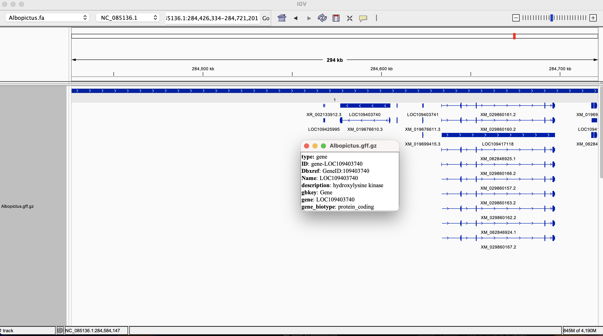

* Let's look at features colored by their strand orientation.

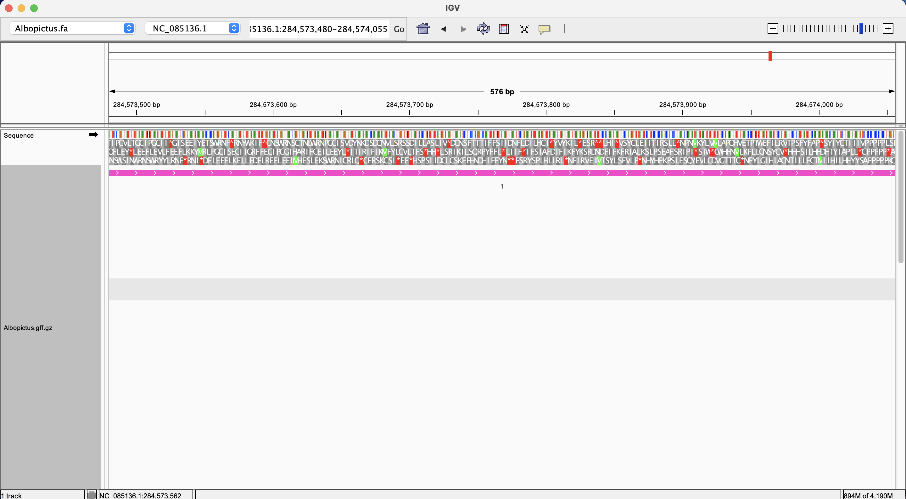
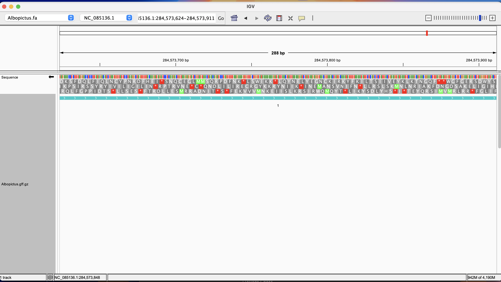


