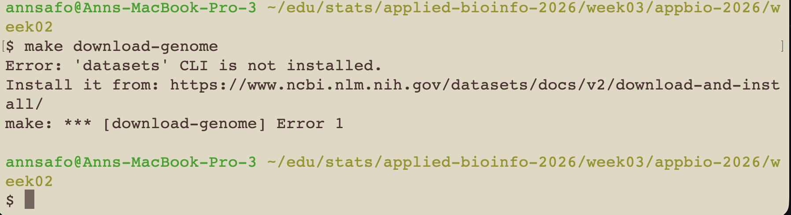
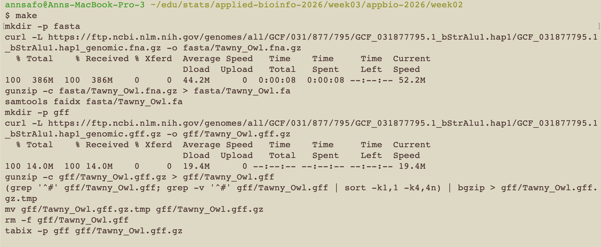
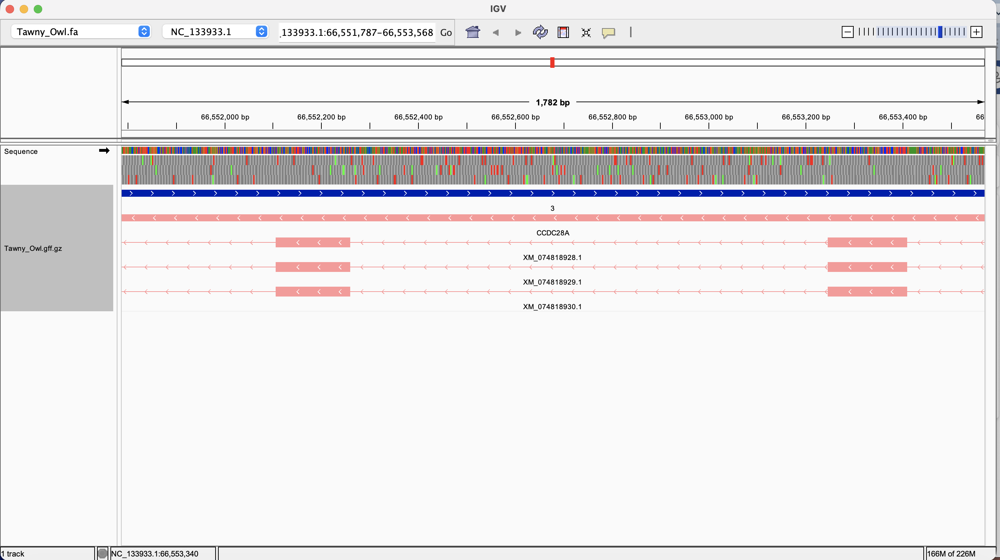

# Collaborating with others via git

### This week, I am forking the repositiory of **Victoria Abramczuk**

## Verification of code safety:
Below, I use the following prompt in Gemini to Verify that the code is not doing something dangerous:
```
"Evaluate the repository at this link and audit the code from a security perspective. to verify that the code will not do anything dangerous if i fork the repo and run the code on my machine:
https://github.com/VAbramRepo/appbio-2026/tree/main/week02"
```

Based on the AI analysis, the code is not a security risk. More specifically,
```
"The only "risk" with this repository is operational, not malicious. As noted in the documentation, because the Makefile uses Unix commands, you must run it inside a Unix-like environment on your Windows machine (like WSL or Git Bash). Running it in the standard Windows Command Prompt will simply result in syntax errors, not a security breach."
```

## Evaluation of README.md 
After assessing the README of the genome visualization assignment, I observe the following: 

- The README.md makes it clear how to run the code(via example usage) and what outputs/results one can expect from the 3 main makefile commands. It also emphasizes the same-directory requirement the author needed to maintain for file loading into IGV.

## Code reproducibility
- To verify that the results are reproducible, I ran the code in the repository to assess whether the results I obtained match what the author says I can expect. I was not able to replicate the results as is shown in the screenshot below:



## Comparison of solution as specified in makefile (Using AI agents)
To Ask the AI Agent to compare my solution to Victoria's I used the prompt below:

```
"okay I will provide the actual text of the makefiles of two repositories one after the other for you to compare"
```

To specifically ask the AI Agent to evaluate which solution it thinks is better, I used the prompt below:

```
"Beyond the general comparison, conduct a more thorough review to evaluate the solution implemented by the makefile for each and why or why not each part of both solutions is or is not preferred over the other."
```

### The paragraphs below summarizes the findings from the AI agent's analysis of both solutions and why it prefreed my repository solution to that of my colleague. 

First, the code, as it is written doesn't take advantage of the automation `make` provides by allowing the user to specify how files depend on one nother and the commands needed to create them. Using large blocks of bash code, the user has to manually run `make download-genome`, wait, and then manually run `make igv-index`. If `igv-index` fails halfway through, running it again triggers a messy series of custom Bash `if [ ! -f ... ]` checks rather than letting Make handle state management natively. Moreover, `make` has no idea that the index depends on the download, forcing the user to remember the exact order of commands. This is in contrast to the approach I took in my repository where I take advantage of `make` to declare the final files I want (all: ${FA}.fai ${GFF}.tbi), and instruct it to calculate the required steps to get there. Thus, if, for example, I ask for ${GFF}.tbi, the script inherently knows it must first download the GFF, unzip it, sort it, re-zip it, and finally index it.

Additionally, by downloading datasets with direct curl commands pointing to the NCBI FTP server, I am able to download only the specific files needed directly into their final compressed .gz format, keeping network overhead and disk usage to an absolute minimum. My colleague's apptroach forces the user to install the external NCBI datasets CLI tool to download a bulk .zip archive, forcing the system to temporarily store both the massive zip archive and the unzipped files simultaneously. This can create a spike in disk usage that can crash environments with limited storage.

Finally, my repository correctly handles the GFF sorting requirement. Specifically, bioinformatics tools like IGV and tabix strictly require GFF files to be sorted by chromosome (-k1,1) and then numerically by start coordinate (-k4,4n). Using the command `(grep '^#'... ; grep -v '^#'... | sort -k1,1 -k4,4n)`, my makefile cleanly separates the metadata headers from the data, sorts the genes by chromosome and coordinate, and puts the headers back on top before compressing to ensure error-free file loading into IGV. My colleague's repo skips this sorting step entirely by passing the raw GFF into bgzip and tabix. This may create errors because The NCBI datasets CLI does not guarantee that GFF files are perfectly coordinate-sorted upon download. Attempting to run tabix on an unsorted GFF could result in a silent failure or a direct error, rendering the annotations unusable in IGV.

## Attempt at making changes to the forked repository
I asked the AI agent to Make a change to the forked repository that addresses an issue using the prompt below:

```
"suggest a change to the vabram repo that addresses an issue you found"
```

Based on the above prompt, I got the following suggestion:

```
Update the igv-index block in the VABRAM Makefile by replacing this existing line:
if [ ! -f "$$gff_gz" ]; then bgzip -c "$$gff" > "$$gff_gz"; fi; \

With this corrected sorting pipeline:
if [ ! -f "$$gff_gz" ]; then \
        (grep '^#' "$$gff"; grep -v '^#' "$$gff" | sort -k1,1 -k4,4n) | bgzip > "$$gff_gz"; \
    fi; \
```

However, after implementing that change, I got the following error from running `make`

```
$ make
Error: 'datasets' CLI is not installed.
Install it from: https://www.ncbi.nlm.nih.gov/datasets/docs/v2/download-and-install/
make: *** [download-genome] Error 1
```

Gemini AI then recommended replacing the makefile with a completely different script, which I have done and pushed to my fork. Additionally, as I am aware that Victoria's device is a Windows laptop, I probed the AI Agent further to verify how this could work for Windows. It seems that as long as the device has WSL and dependencies installed, it should work. I also confirmed from the week 1 setup instructions that windows users were instructed to do this. 

#### Once I pasted the updated script in the makefile, I was able to successfully execute `make` as seen in the screenshot below:



Here is an IGV visualization from the Tawny Owl genome:



Finally, I commit and push the change to the fork, create a pull request to the original repository on the GitHub interface so the author will review the pull request and merge it if they agree with the changes.

## Below is a URL of the pull request
[Pull request link](https://github.com/VAbramRepo/appbio-2026/pull/2)
