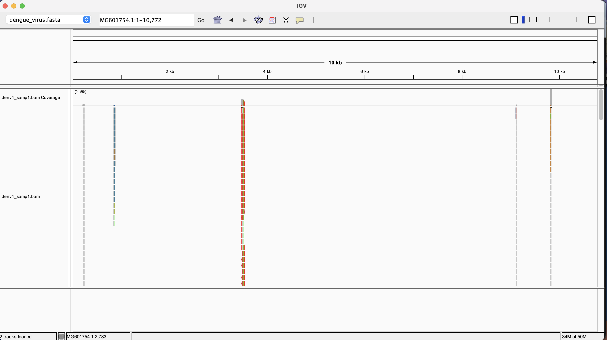
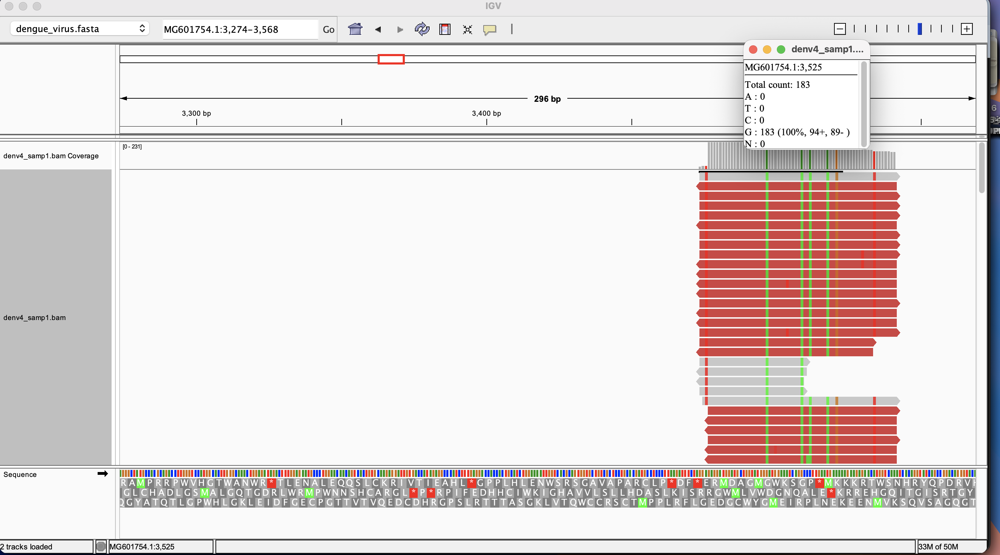
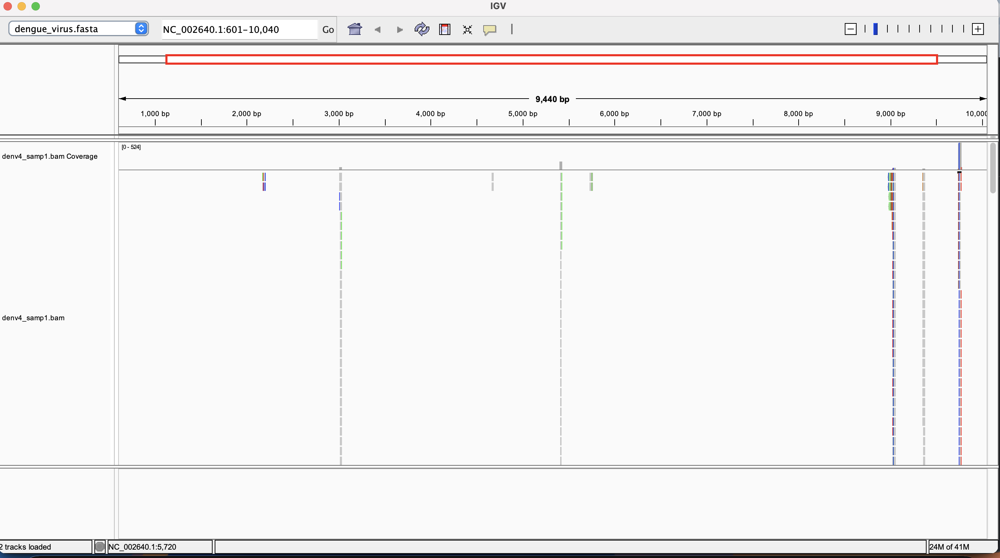
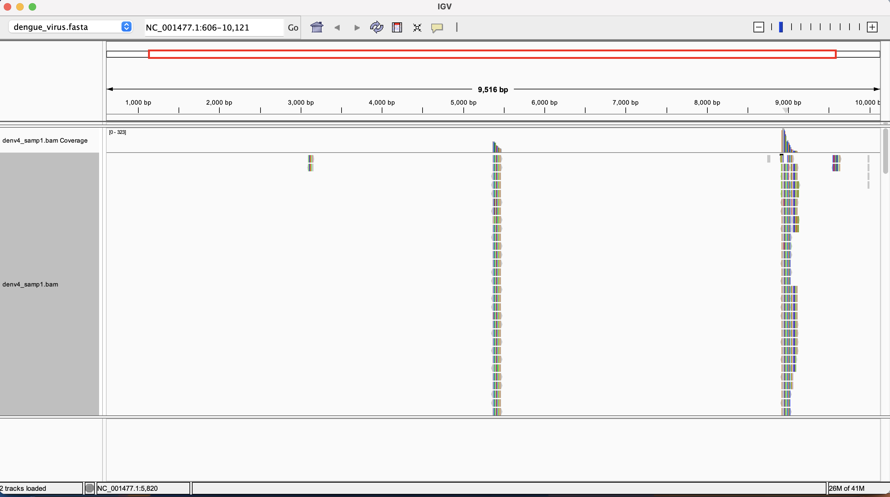
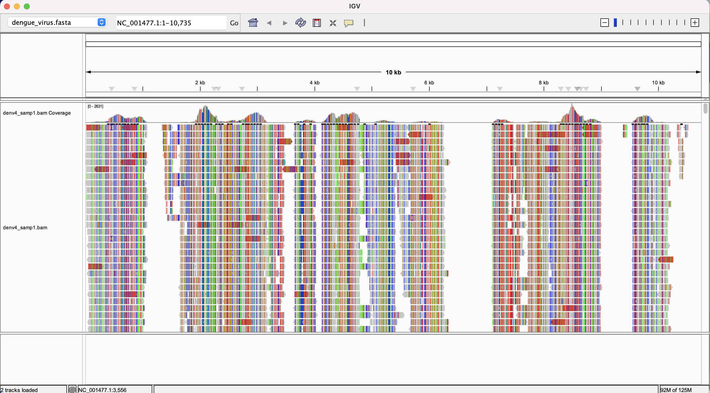
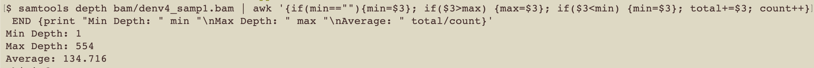
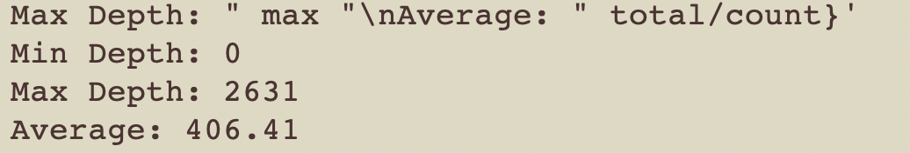

# Generating a BAM file
Next up, is aligning the reads to the genome and creating a BAM alignment file. 

## Choosing the number of reads (N) to align
We will work with a subset of N reads, not the whole dataset. Using the genome size and the sequencing data properties, estimate the N number of reads you should download to get a coverage of at least 10x. Th goal is to check whether the number we obtain for *Aedes albopictus* is more than a million.

We use the formula below for the calculation. It is the Lander/Waterman equation found at this [link](https://www.illumina.com/documents/products/technotes/technote_coverage_calculation.pdf):

C = LN / G

C = target coverage = 10
L = read length = 150 per read = 2 x 150 = 300 for paired end
G = genome length = 1.3 Gb for our reference [Aalb5](https://www.ncbi.nlm.nih.gov/datasets/genome/GCF_035046485.1/)

N = read length = ?

CG = LN; N = CG / L

N = 10(1.3 x 10^9) / 300 = 43, 333 333.33

We obtain over 43 million so we need to pivot to a different genome as this genome alignment process requires more powerful hardware than we have at our disposal.

We pivot to using Dengue Virus Serotype 4(DENV4), a pathogen which *Ae. albopictus* is a competent vector of. It has a genome size of 10.6kb. 


## Accession information for Dengue Virus (DENV)
- The genome accession (NCBI RefSeq assembly) is GCF_000865065.1. 
- The project accession is PRJNA1346681
- From that project I chose run SRR35818859

## New selection calculation for number of reads with DENV
N = 10 (10800) / (102 + 104) = 524.2718447

524 is very low compared to 43 million! Let's use 20 000 as we did in class. 

# Examine read alignment
Run statistics on the bam files by running the following in terminal

```
samtools flagstat bam/denv4_samp1.bam > bam/denv4_samp1_flagstat.txt

samtools coverage bam/denv4_samp1.bam > bam/denv4_samp1_coverage.txt
```

Read the generated reports by running the following in the terminal:

```
cat bam/denv4_samp1_flagstat.txt
cat bam/denv4_samp1_coverage.txt
```

# Visualize the BAM file in IGV.

## Error troubleshooting
Below is a screenshot of the BAM file in IGV after using GCA_031101955.1 and SRR35818859. It seems the sample and reference don't match.





Trying another reference, with the same sample: GCF_000865065.1




Perhaps the error is from the wrong serotype so try serotype 1 as a reference (GCF_000862125.1) with the same sample. I still get a weird output:



Finally, retry with the following changes:
 - new reference: GCF_000862125.1
 - new SRR: SRR35818875
 
 
 

## Read alignment statistics
- Based on samtools,** 2.34%** of the reads align.

### Is the coverage uniform?

```
samtools depth bam/denv4_samp1.bam | awk '{if(min==""){min=$3}; if($3>max) {max=$3}; if($3<min) {min=$3}; total+=$3; count++} END {print "Min Depth: " min "\nMax Depth: " max "\nAverage: " total/count}'
```

Below, is the the coverage details for the original alignment


The new alignment:


The spread of read depth indicates high variance and skewness which suggests coverage is non-uniform.

## How to run the makefile 
Run the following:

```
make all
```


