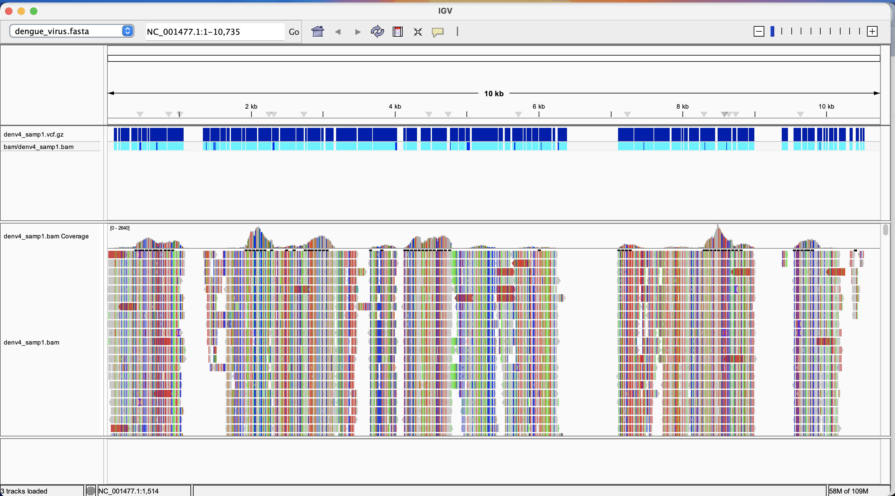
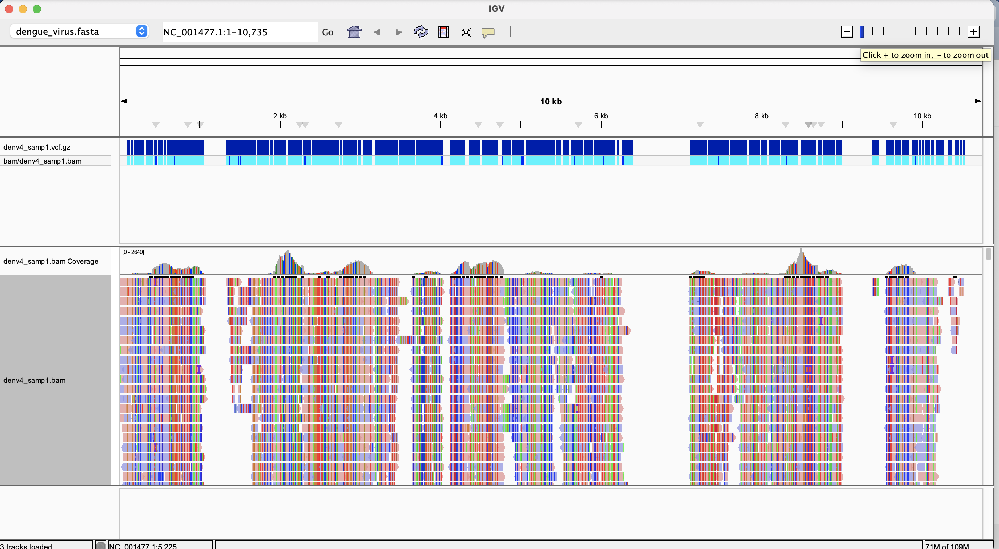
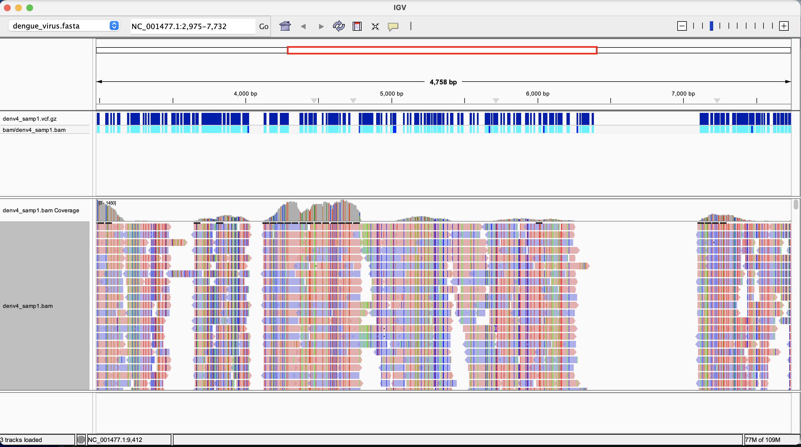
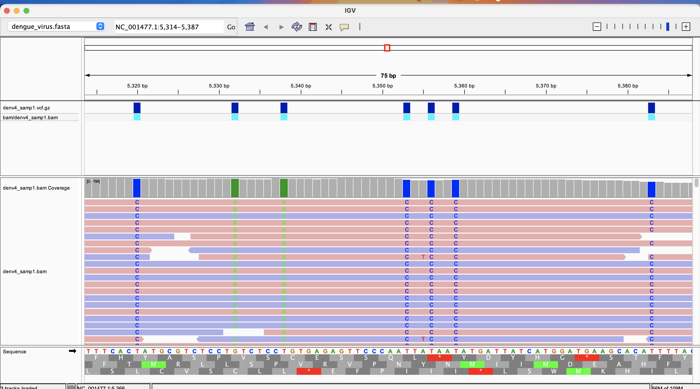
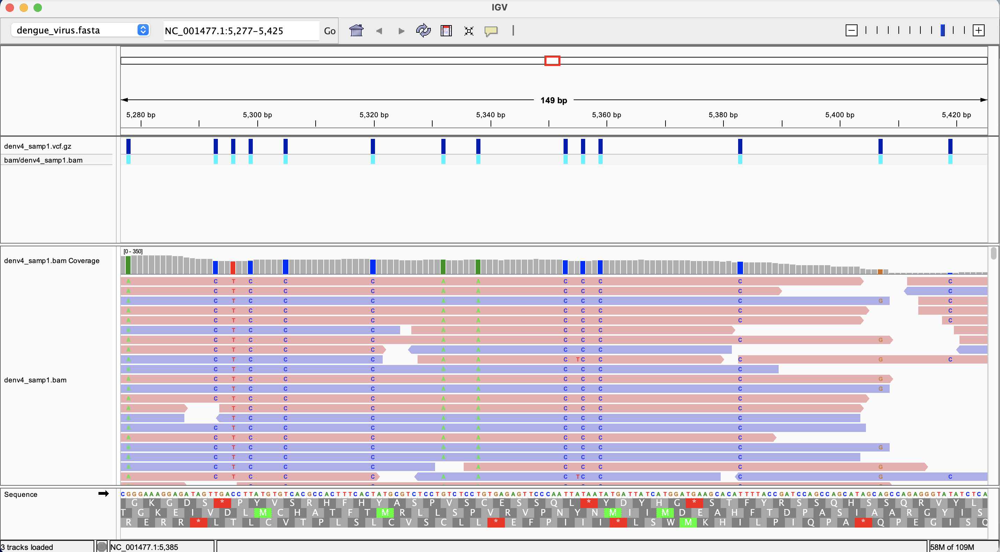
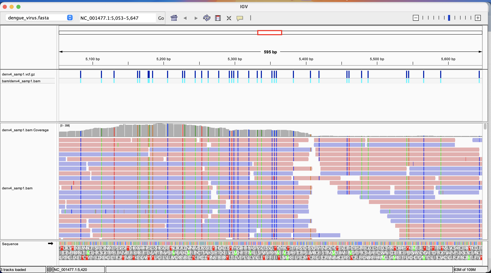
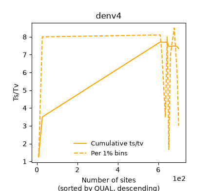
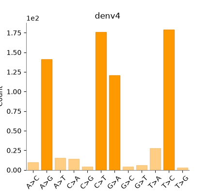
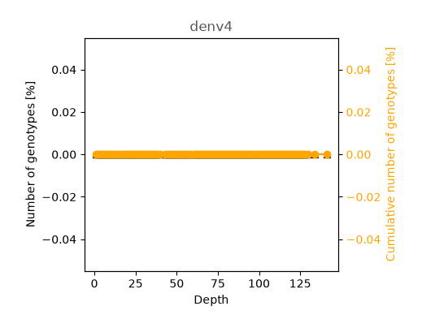

# Generate a VCF file

In week 5,we aligned reads to the dengue virus type 1 genome and created a BAM file.

Here, we call variants from that alignment and create a VCF file. 


## Calling variants from the BAM file
Run the Makefile that calls variants and creates a VCF file by running the following in the teminal after activating ```bioinfo```:

```
make all
```


## Visualize the VCF file in IGV.
 Below are different views of the vcf file in igv













## Run a statistics report on the VCF file.

Run the following to view statistics on the variant calling process:

```
bcftools stats vcf/denv4_samp1.vcf.gz
```

To look at some of these statistics graphically, run the following:

```
bcftools stats vcf/denv4_samp1.vcf.gz > stats.txt
plot-vcfstats stats.txt vcf/
```
This generates the following graphs:








**Below are some details from the statistics report**
 
- Number of variants called (records): 701

- Kinds of variants present: All **701** variants are SNPs

Which calls look like true variants, and which look like errors?

- Are the calls supported by the alignments?
The alignments indicate substitutions which support the calls as seen in the pileup. Example below


